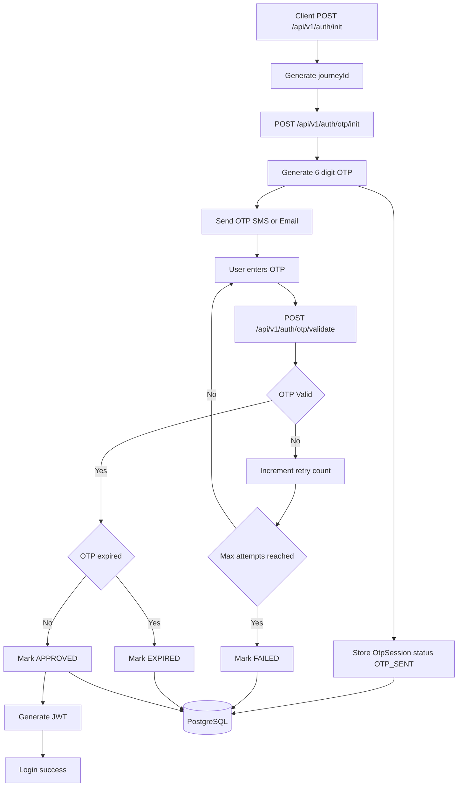

# OTP Auth Journey

```mermaid
flowchart TD
    A[Client POST /api/v1/auth/init] --> B[Generate journeyId]
    B --> C[POST /api/v1/auth/otp/init]
    C --> D[Generate 6 digit OTP]
    D --> E[Store OtpSession status OTP_SENT]
    D --> F[Send OTP SMS or Email]
    F --> G[User enters OTP]
    G --> H[POST /api/v1/auth/otp/validate]
    H --> I{OTP Valid}
    I -->|No| J[Increment retry count]
    J --> K{Max attempts reached}
    K -->|Yes| L[Mark FAILED]
    K -->|No| G
    I -->|Yes| M{OTP expired}
    M -->|Yes| N[Mark EXPIRED]
    M -->|No| O[Mark APPROVED]
    O --> P[Generate JWT]
    P --> Q[Login success]

    E --> DB[(PostgreSQL)]
    L --> DB
    N --> DB
    O --> DB
```
