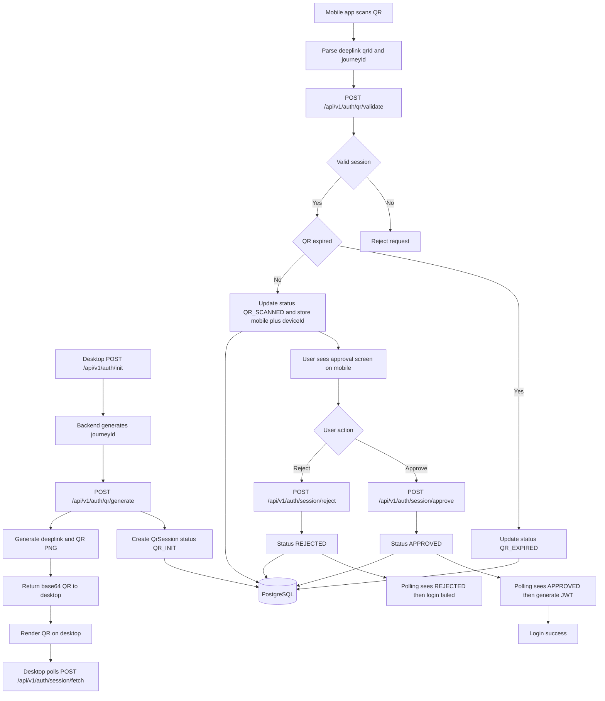

# QR Auth Journey

```mermaid
flowchart TD
    A[Desktop POST /api/v1/auth/init] --> B[Backend generates journeyId]
    B --> C[POST /api/v1/auth/qr/generate]
    C --> D[Create QrSession status QR_INIT]
    C --> E[Generate deeplink and QR PNG]
    E --> F[Return base64 QR to desktop]
    F --> G[Render QR on desktop]

    M1[Mobile app scans QR] --> M2[Parse deeplink qrId and journeyId]
    M2 --> M3[POST /api/v1/auth/qr/validate]
    M3 --> M4{Valid session}
    M4 -->|No| M5[Reject request]
    M4 -->|Yes| M6{QR expired}
    M6 -->|Yes| M7[Update status QR_EXPIRED]
    M6 -->|No| M8[Update status QR_SCANNED and store mobile plus deviceId]

    G --> P1[Desktop polls POST /api/v1/auth/session/fetch]
    M8 --> P2[User sees approval screen on mobile]
    P2 --> P3{User action}
    P3 -->|Approve| P4[POST /api/v1/auth/session/approve]
    P3 -->|Reject| P5[POST /api/v1/auth/session/reject]
    P4 --> P6[Status APPROVED]
    P5 --> P7[Status REJECTED]
    P6 --> P8[Polling sees APPROVED then generate JWT]
    P8 --> P9[Login success]
    P7 --> P10[Polling sees REJECTED then login failed]

    D --> DB[(PostgreSQL)]
    M7 --> DB
    M8 --> DB
    P6 --> DB
    P7 --> DB
```
