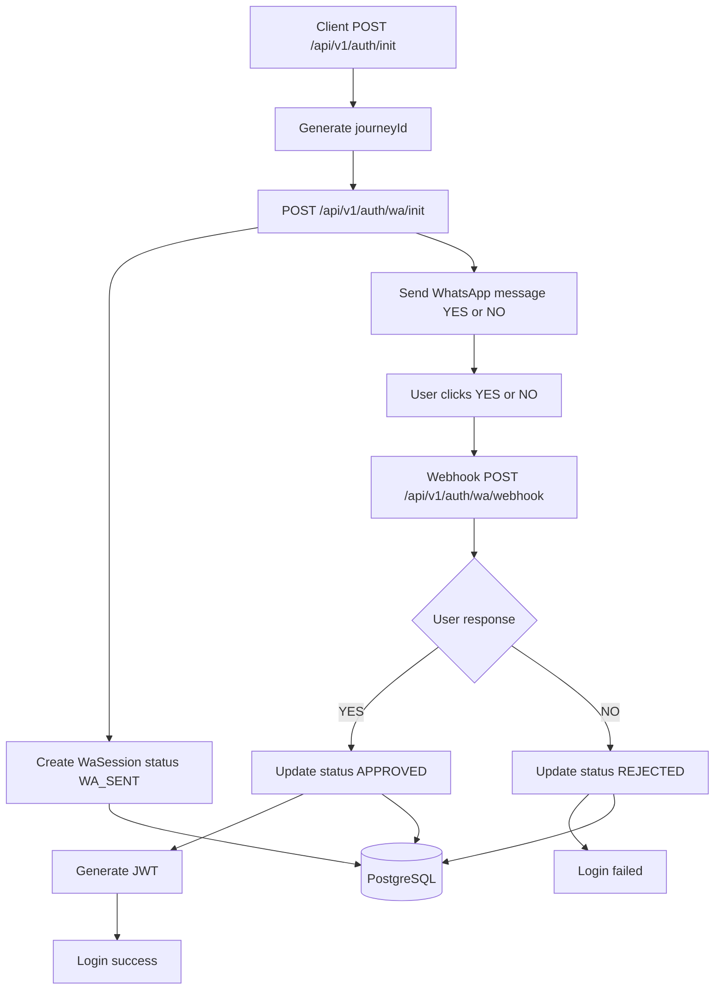

# WhatsApp Auth Journey

## Flowchart

```mermaid
flowchart TD
    A[Client POST /api/v1/auth/init] --> B[Generate journeyId]
    B --> C[POST /api/v1/auth/wa/init]
    C --> D[Create WaSession status WA_SENT]
    C --> E[Send WhatsApp message YES or NO]
    E --> F[User clicks YES or NO]
    F --> G[Webhook POST /api/v1/auth/wa/webhook]
    G --> H{User response}
    H -->|YES| I[Update status APPROVED]
    H -->|NO| J[Update status REJECTED]
    I --> K[Generate JWT]
    K --> L[Login success]
    J --> M[Login failed]

    D --> DB[(PostgreSQL)]
    I --> DB
    J --> DB
```

## Sequence Diagram

