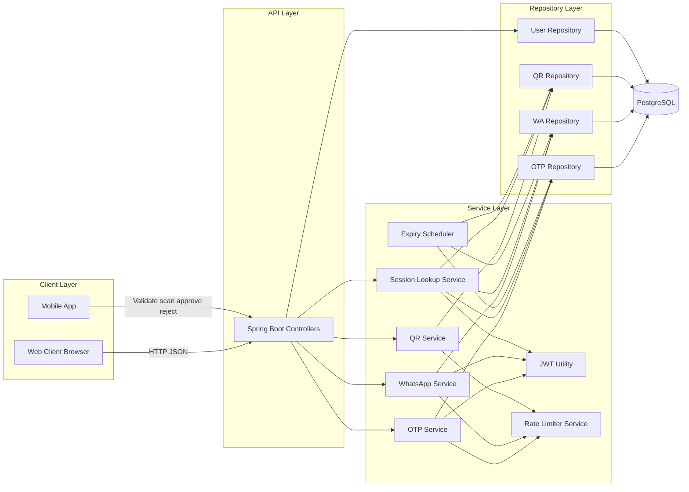

# HybridAuth System Architecture

## Notes

- Controllers expose REST APIs for init, validate, session polling, and user details.
- Session lookup unifies OTP, WA, and QR session state resolution.
- JWT is generated after successful validation or approved status.
