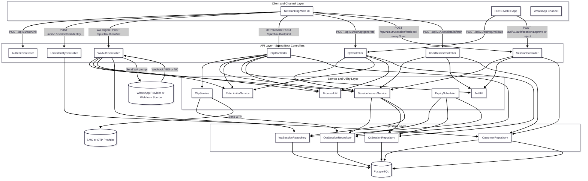

# HybridAuth Complete System Architecture

## Runtime Behavior Summary

- WhatsApp-first path:
    - Identify user
    - If WhatsApp enabled, initiate WA auth
    - Poll session status
    - On approved, fetch user details and login success

- OTP fallback path:
    - Initiate OTP
    - Validate OTP
    - On valid OTP, fetch user details and login success

- QR path:
    - Generate QR from web
    - Validate QR from mobile app
    - Approve or reject session on mobile
    - Web polls session to finalize login outcome
